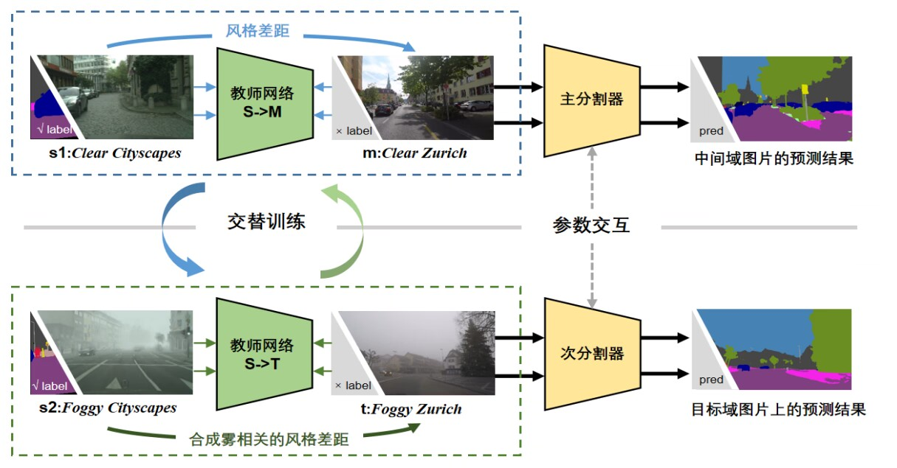
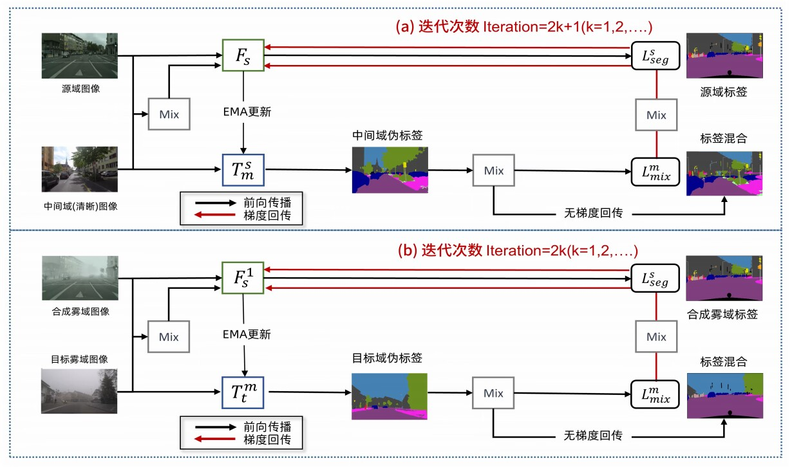

# DtFormer: 基于自训练范式的雾天场景鲁棒语义分割算法

> 在高等级自动驾驶的底层架构中，一个适应于各种天气条件的感知系统是必不可少的，而视觉语义分割技术是构建此类系统的重要组成部分。目前，大多数语义分割模型是在清晰的视觉环境下训练的，很少有模型能够考虑到恶劣天气如雾天对性能的影响。DtFormer正是为解决这一挑战而设计，它是一个基于多层次教师自训练的雾天场景鲁棒语义分割算法，能够显著提升模型在雾天等恶劣天气条件下的表现。
>
>
> 可访问 [作品主页](https://mumuyeye.github.io/DtFormer/README.html)。

## 技术背景与挑战

雾天场景语义分割(SFSS)是一个特别具有挑战性的问题，因为雾造成的图像模糊增加了识别难度，且相关数据标注成本高昂。尽管使用领域自适应技术可以从清晰场景迁移到雾天场景，但由于雾影响导致的图像质量下降和不同城市间的风格差异，使得现有方法的效果并不理想。**DtFormer**通过引入中间域来解耦域间隙，逐步优化雾天场景的语义分割效果，展示出优异的抗干扰性能。

## 结构概览

- **configs**: 存放各种域适应配置文件，包括数据增强和迁移学习策略。
- **demo**: 提供实际应用示例，演示域适应图像分割的实现。
- **learn**: 包含学习和实验相关的脚本。
- **mmseg**: 框架的核心模块，涵盖 API、数据集处理、模型定义等。
- **pretrained**: 存放预训练模型和提示信息。
- **tools**: 包括数据集转换、度量学习、测试时增强 (TTA) 等实用工具。

## 核心功能

- **域适应图像分割**: 处理不同域间的图像分割问题，采用无监督、半监督和自监督学习策略。
- **强大的数据处理**: 支持广泛的数据处理和增强技术，以提升模型在新域的表现。

## 安装说明

1. 克隆本仓库到本地。
2. 修改 `configs` 目录下的配置文件，以符合具体的应用需求。
3. 运行 `demo` 目录下的示例脚本，观察不同域适应策略的效果。

## 雾天场景语义分割 (SFSS)

**DtFormer** 采用了一种创新的多层次教师自训练方法，通过拆解域差距，以促进带标签清晰源域中的分割知识向无标签目标雾域的有效迁移。该方法设计了四个关键域：带标签清晰源域、带标签合成雾源域、无标签中间域、和无标签雾域，并在这些域中利用两种类型的分割器：学生分割器和教师分割器，进行知识迁移和增强学习。

### 分割器设计与流程

1. **分割器配置**：DtFormer 设计了两个学生分割器和两个教师分割器。学生分割器包括一个主分割器（最终发布的模型）和一个次分割器，而教师分割器则负责在无标签的中间域和目标域上生成伪标签，以指导学生分割器的训练。
2. **域适应处理**：主分割器与中间域教师分割器组成一组，处理从清晰源域到中间域的迁移；次分割器与目标域教师分割器组成另一组，处理从合成雾源域到目标雾域的迁移。这种分组确保了两个处理流程之间的梯度不会相互干扰。
3. **交替训练与信息交互**：为最大化学习效果，DtFormer 实施了交替训练策略。在奇数次迭代中，执行清晰源域到中间域的学习；在偶数次迭代中，执行合成雾源域到目标雾域的学习。此外，训练开始时，主分割器和次分割器通过指数移动平均（EMA）方式接收来自上一次迭代的信息，以确保信息的连续性和稳定性。

### 优势与应用

通过将域差距拆分为两部分：一部分处理清晰源域到中间域的风格特征解耦，另一部分处理合成雾源域到目标雾域的包含雾的风格差距，DtFormer 能够有效增强模型在复杂雾天场景下的域适应能力。这种方法不仅提高了模型的精确度，还扩展了其在恶劣气候条件下的应用潜力。

## 训练 Pipeline

**DtFormer** 使用四个不同的数据域来进行训练，这些域包括带标签清晰源域 $ S $、带标签合成雾源域 $ \overline{S} $、无标签中间域 $ \mathcal{M} $ 和无标签雾域 $ T $。通过这种多层次教师自训练的方法，**DtFormer** 旨在拆解域差距，并将源域中的知识有效迁移至目标雾域。

### 分割器配置和流程

1. **学生分割器**：包括主分割器 $ F_s $ 和次分割器 $ F_s^1 $，分别负责学习带标签的源域和合成域信息。
2. **教师分割器**：$ T_m^s $ 和 $ T_t^t $，分别在无标签的中间域 $ \mathcal{M} $ 和雾域 $ T $ 上生成伪标签，指导学生分割器的训练。

### 训练策略和技术

- **组织结构**：主分割器 $ F_s $ 和中间域教师 $ T_m^s $ 以及次分割器 $ F_s^1 $ 和目标域教师 $ T_t^t $ 分别组成两个训练小组，专注于处理不同的域迁移任务：$ S \rightarrow \mathcal{M} $ 和 $ \overline{S} \rightarrow T $。
- **交替训练与信息交互**：为避免梯度干扰，采用交替训练策略。奇数次迭代专注于 $ S \rightarrow \mathcal{M} $，偶数次迭代专注于 $ \overline{S} \rightarrow T $。此外，主分割器和次分割器在训练初期通过指数移动平均（EMA）形式接收前一迭代的信息，确保信息的连续性和学习的稳定性。

### 域适应能力的增强

通过将域差距拆分为两部分，$ S \rightarrow \mathcal{M} $ 解决风格特征的解耦问题，而 $ \overline{S} \rightarrow T $ 则处理包含雾的复杂风格差距。这种策略显著减小了模型面对的域差距，提高了在雾天条件下的表现和适应能力。

## 专利和软著

我们也已为本作品申请了一项国家发明专利与一项软件著作权（均在审核中）:

